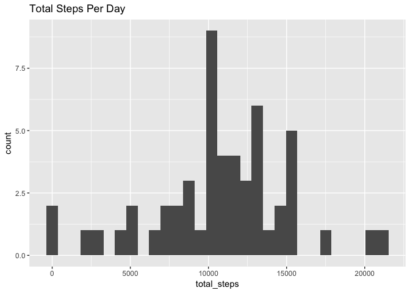
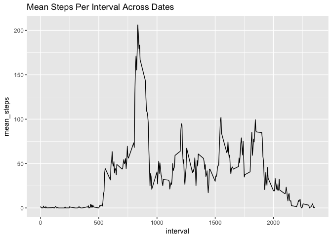
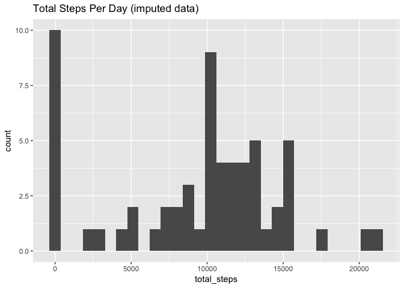
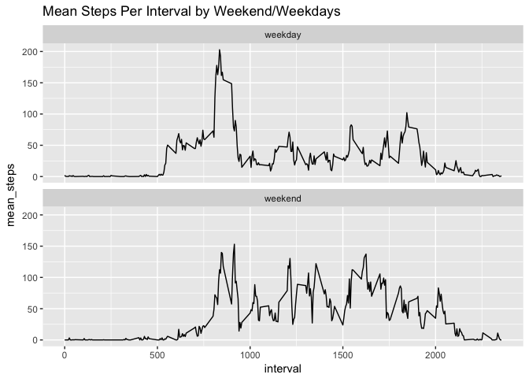

# Reproducible Research: Peer Assessment 1


## Loading and preprocessing the data


```r
df <- read.csv(paste0('/Users/garymu/Dropbox (Personal)/Coursera/DS/',
               'reproducible_research/assignment1/activity.csv'))
```

## What is mean total number of steps taken per day?


```r
summary_steps <- df %>% 
    filter(!is.na(steps)) %>%
    group_by(date) %>%
    summarise(total_steps = sum(steps, na.rm = T),
              mean_steps = mean(steps, na.rm = T),
              median_steps = median(steps, na.rm = T))

p1 <- ggplot(summary_steps) + 
        geom_histogram(aes(x = total_steps)) +
        ggtitle('Total Steps Per Day')

#histogram of total steps taken per day
p1
```

```
## `stat_bin()` using `bins = 30`. Pick better value with `binwidth`.
```

<!-- -->

```r
#summary of steps taken per day (total, mean, median)
summary_steps
```

```
## # A tibble: 53 x 4
##          date total_steps mean_steps median_steps
##        <fctr>       <int>      <dbl>        <dbl>
##  1 2012-10-02         126    0.43750            0
##  2 2012-10-03       11352   39.41667            0
##  3 2012-10-04       12116   42.06944            0
##  4 2012-10-05       13294   46.15972            0
##  5 2012-10-06       15420   53.54167            0
##  6 2012-10-07       11015   38.24653            0
##  7 2012-10-09       12811   44.48264            0
##  8 2012-10-10        9900   34.37500            0
##  9 2012-10-11       10304   35.77778            0
## 10 2012-10-12       17382   60.35417            0
## # ... with 43 more rows
```

```r
#mean, median total number of steps taken per day
print(paste0('mean total number of steps taken per day is: ', mean(summary_steps$mean_steps, na.rm = T)))
```

```
## [1] "mean total number of steps taken per day is: 37.3825995807128"
```

```r
print(paste0('median total number of steps taken per day is: ',median(summary_steps$mean_steps, na.rm = T)))
```

```
## [1] "median total number of steps taken per day is: 37.3784722222222"
```

mean total number of steps taken per day is 37.3826 steps, and median is 37.37847 steps.

## What is the average daily activity pattern?


```r
interval <- df %>% 
                group_by(interval) %>%
                summarise(mean_steps = mean(steps, na.rm = T))

p2 <- ggplot(interval, aes(interval, mean_steps)) + 
        geom_line() +
        ggtitle('Mean Steps Per Interval Across Dates')

#histogram of mean steps taken per interval Across Dates
p2
```

<!-- -->

```r
#which interval has the highest mean steps
interval$interval[which.max(interval$mean_steps)]
```

```
## [1] 835
```
The interval that has the highest mean steps is interval 835.

## Imputing missing values


```r
#total dimension of steps data
dim(df)
```

```
## [1] 17568     3
```

```r
#total number of rows with missing steps
sum(is.na(df$steps))
```

```
## [1] 2304
```

```r
#impute the NA rows with the mean value of the day

df2 <- df

for(i in 1:nrow(df2)){
    if(is.na(df2$steps[i])){
        if(df2$date[i] %in% as.character(summary_steps$date)){
             df2$steps[i] = summary_steps$mean_steps[summary_steps$date== df2$date[i]]
        }else{
            df2$steps[i] = 0
        }
    }
}


summary_steps2 <- 
    df2 %>% 
        group_by(date) %>% 
        summarise(total_steps = sum(steps),
                  mean_steps = mean(steps))

p3 <- ggplot(data = summary_steps2) + 
              geom_histogram(aes(x = total_steps))+
              ggtitle('Total Steps Per Day (imputed data)')


p3
```

<!-- -->

```r
#original steps mean
mean(df$steps, na.rm = T)
```

```
## [1] 37.3826
```

```r
#steps mean with na imputed with the mean of the day
mean(df2$steps)
```

```
## [1] 32.47996
```
There are 2304 observations with NA values.


The mean increased after we imputed values as expected: 32.48 vs 37.38.

## Are there differences in activity patterns between weekdays and weekends?


```r
#convert the dates to weekday
df2 <- df2 %>% 
            mutate(weekday = weekdays(as.Date(date))) %>%
            mutate(weekday2 = ifelse(weekday %in% c('Sunday', 'Saturday'), 'weekend', 'weekday'))

df3 <- df2 %>%
    group_by(weekday2, interval) %>%
    summarise(mean_steps = mean(steps))

ggplot(df3)+ 
    geom_line(aes(x = interval, y = mean_steps)) + 
    facet_wrap(~weekday2, ncol = 1) +
    ggtitle('Mean Steps Per Interval by Weekend/Weekdays')
```

<!-- -->

